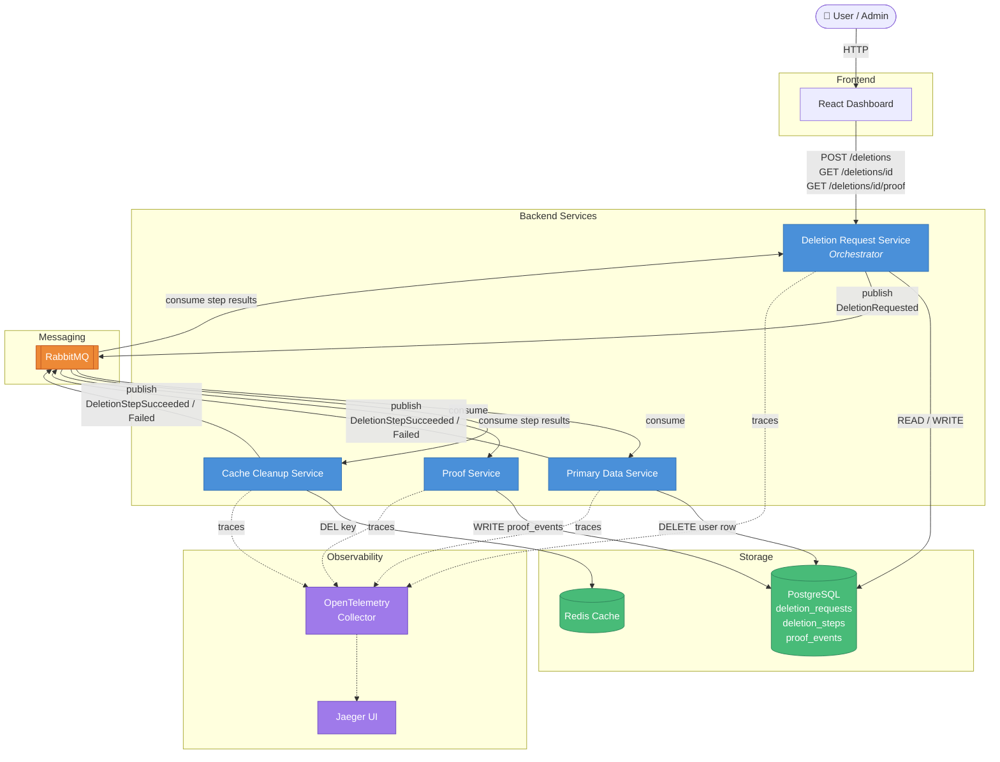
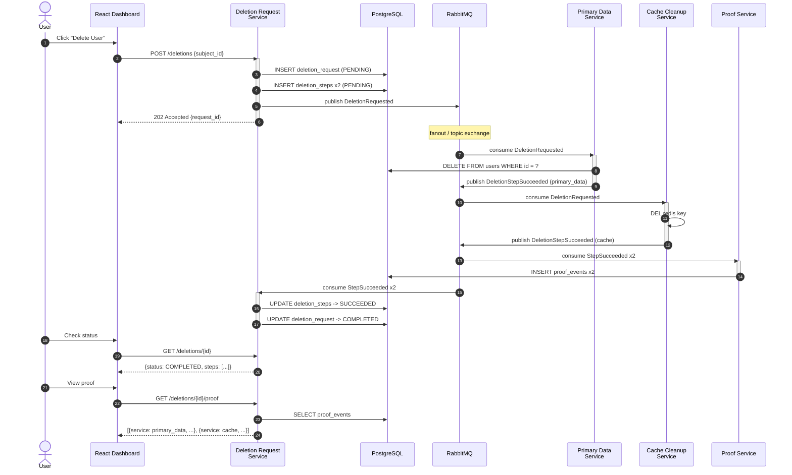
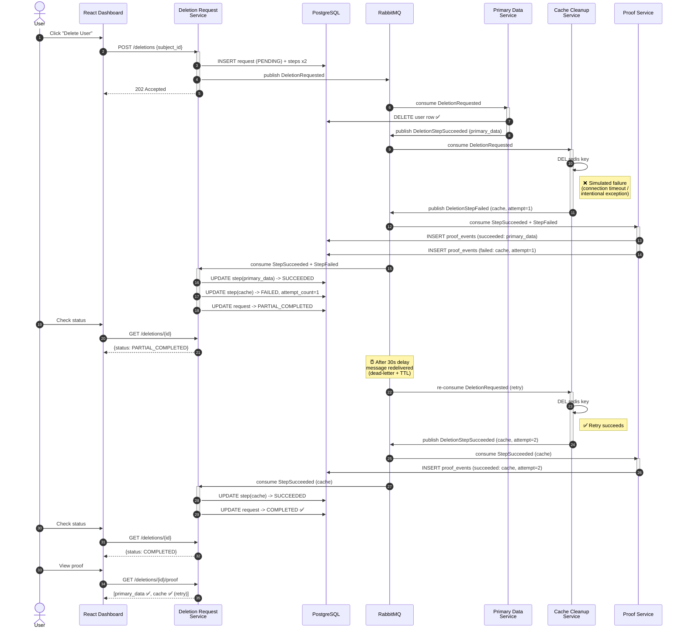

# EraseGraph — Architecture & Sequence Diagrams

This document uses **Mermaid** syntax. GitHub renders it natively.  
To export as PNG / SVG, see the "Export Options" section at the bottom.

---

## 1. System Architecture Diagram (MVP)



**Legend**

| Color | Meaning |
|-------|---------|
| 🔵 Blue | Backend microservices |
| 🟢 Green | Persistent storage (PostgreSQL / Redis) |
| 🟠 Orange | Message queue (RabbitMQ) |
| 🟣 Purple | Observability (OpenTelemetry + Jaeger) |
| Solid arrow | Synchronous HTTP or direct read/write |
| Dashed arrow | Asynchronous tracing data |

---

## 2. Success Sequence Diagram (Normal Deletion Flow)



---

## 3. Failure & Recovery Sequence Diagram (Cache Cleanup Fails -> Retry -> Recovery)



---

## Export Options (Mermaid -> PNG / SVG)

The three diagrams above use [Mermaid](https://mermaid.js.org/) syntax and render natively in **GitHub Markdown**.

If you need to export them as image files (for reports, slides, or papers), here are the recommended options:

### Option 1: Mermaid Live Editor (Fastest, Zero Install)
1. Open [https://mermaid.live](https://mermaid.live)
2. Paste the text between ` ```mermaid ` and ` ``` ` into the editor
3. The right panel renders in real time — click **Download PNG** or **Download SVG**

### Option 2: VS Code Extension
- Install the extension: **Markdown Preview Mermaid Support** (`bierner.markdown-mermaid`)
- Open this file → `Cmd+Shift+V` to preview → right-click the diagram to copy/export

### Option 3: CLI Export (CI / Automation)
```bash
# Install Mermaid CLI
npm install -g @mermaid-js/mermaid-cli

# Export individual diagrams (extract code blocks into .mmd files first)
mmdc -i docs/architecture.mmd -o docs/architecture.png -t dark -b transparent
mmdc -i docs/sequence-success.mmd -o docs/sequence-success.png
mmdc -i docs/sequence-failure-retry.mmd -o docs/sequence-failure-retry.png
```

### Option 4: Other Professional Tools (For More Complex Diagrams)
| Tool | Features | Recommended For |
|------|----------|-----------------|
| [draw.io / diagrams.net](https://app.diagrams.net) | Free, drag-and-drop, exports PNG/SVG/PDF | Complex architecture diagrams, custom styling |
| [Excalidraw](https://excalidraw.com) | Hand-drawn style, great for whiteboard presentations | Demos / teaching scenarios |
| [Lucidchart](https://www.lucidchart.com) | Professional collaboration, rich templates | Enterprise documentation |
| PlantUML | Text-driven, CI-friendly | Sequence diagrams, class diagrams |

---

> 💡 **Tip**: Use the Mermaid diagrams in this file as a "living document" — they render automatically after pushing to GitHub.
> When you need images for homework or slides, export them at [mermaid.live](https://mermaid.live).
