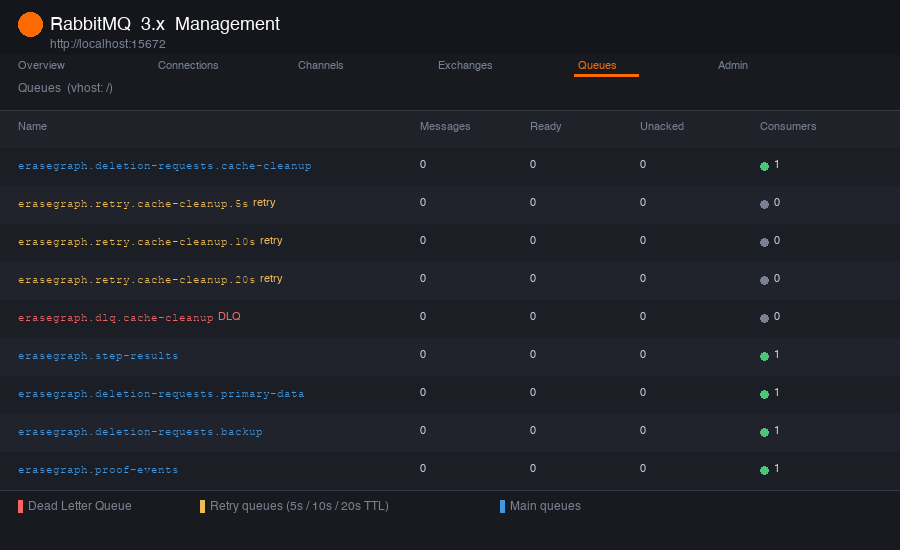

# Failure Retry Design

## Why async systems need retries

EraseGraph sends deletion work through RabbitMQ because every downstream cleanup service can have different latency and failure modes. A cache service might be briefly unavailable while the primary database cleanup succeeds. Without retry logic, one temporary failure would immediately turn the whole deletion into a permanent failure.

Retries let the system absorb short outages while still preserving an audit trail. The request can show `RETRYING`, wait a controlled amount of time, and then try again. If the failure keeps happening, the message is moved to a dead letter queue so the team can inspect it instead of losing it or looping forever.

## Retry queue and DLQ flow

The cache cleanup service uses these RabbitMQ resources:

- Main exchange: `erasegraph.events`
- Retry exchange: `erasegraph.retry`
- Dead letter exchange: `erasegraph.dlq`
- Main cache queue: `erasegraph.deletion-requests.cache-cleanup`
- Retry queues:
  - `erasegraph.retry.cache-cleanup.5s`
  - `erasegraph.retry.cache-cleanup.10s`
  - `erasegraph.retry.cache-cleanup.20s`
- Dead letter queue: `erasegraph.dlq.cache-cleanup`

When cache cleanup fails, the service publishes a `DeletionStepRetrying` event and republishes the original deletion event to the retry exchange. The retry queue keeps the message for its TTL, then dead-letters it back to the main cache queue with routing key `deletion.requested.cache`.

Retry count is stored in RabbitMQ message headers as `retry-count`.

Duplicate first-attempt messages are guarded by the Postgres `processed_events` table. The cache service atomically inserts the incoming `event_id` before running cleanup; if the insert conflicts, the message is acknowledged and a `DUPLICATE_EVENT_IGNORED` proof event is recorded.

## Message lifecycle

1. Backend creates a deletion request and publishes `DeletionRequested` with a unique `event_id`.
2. Cache cleanup consumes the message from `erasegraph.deletion-requests.cache-cleanup`.
3. If cleanup succeeds, it publishes `DeletionStepSucceeded`.
4. If cleanup fails on attempt 1, it publishes `DeletionStepRetrying`, sets the step to `RETRYING`, and sends the message to the 5 second retry queue.
5. If cleanup fails again, it repeats the same flow for 10 seconds and then 20 seconds.
6. After 3 retries, the service publishes `DeletionStepFailed` and sends the message to `erasegraph.dlq.cache-cleanup`.
7. The backend event consumer records proof events and updates `deletion_steps.status`.

## RabbitMQ queues

The queues below are live in the running stack. All retry and DLQ queues are durable so messages survive broker restarts.



| Queue | Role |
|-------|------|
| `erasegraph.deletion-requests.cache-cleanup` | Main delivery queue — cache-cleanup-service consumes from here |
| `erasegraph.retry.cache-cleanup.5s` | First retry — 5 second TTL, dead-letters back to main queue |
| `erasegraph.retry.cache-cleanup.10s` | Second retry — 10 second TTL |
| `erasegraph.retry.cache-cleanup.20s` | Third (final) retry — 20 second TTL |
| `erasegraph.dlq.cache-cleanup` | Dead letter queue — receives messages after 3 failed retries |
| `erasegraph.step-results` | Backend event consumer — receives step succeeded/failed/retrying events |

## Status meanings

`RETRYING` means a cleanup step failed temporarily and has been scheduled for another attempt. The request is still active.

`FAILED` means the cleanup step exhausted retries or hit a permanent error. The request is no longer waiting for that step.

`PARTIAL_COMPLETED` means the request finished without every step succeeding. In this design, a circuit breaker skip can produce `PARTIAL_COMPLETED` because the system intentionally skipped a downstream service that was considered unavailable.

## Circuit breaker states

Circuit breaker state is stored in Redis:

- `circuit:<service_name>:state`
- `circuit:<service_name>:failure_count`
- `circuit:<service_name>:open_until`

`CLOSED` is normal operation. The service processes deletion messages.

`OPEN` means the service has had 3 consecutive failures. New first-attempt deletion messages are skipped immediately, the backend records `CIRCUIT_OPEN_SKIP`, and the step is marked `SKIPPED_CIRCUIT_OPEN`.

`HALF_OPEN` means the 30 second open window has expired. The next allowed request is treated as a test. If it succeeds, the circuit returns to `CLOSED`; if it fails, the circuit opens again.

The current circuit state is exposed at:

```text
GET /admin/circuits
```

## Optional DLQ replay

The backend exposes a manual replay endpoint for supported DLQs:

```text
POST /admin/dlq/cache-cleanup/replay
```

The endpoint drains the initial contents of `erasegraph.dlq.cache-cleanup` and republishes each message to `erasegraph.events` with routing key `deletion.requested.cache`. It only replays the messages present when the call starts, so messages that fail again and return to the DLQ during replay are not replayed again in the same request.

## Optional API gateway

The optional API gateway runs on container port `3000` and proxies requests to the backend after validating:

```text
X-Service-Token: erasegraph_internal_token
```

The health endpoint `/health` does not require a token. Other requests without the token return `401 Unauthorized`.

## Demo triggers

Use subject IDs to force cache cleanup failures without changing code:

- `fail-<anything>` fails on the first cache attempt, then succeeds on retry.
- `fail-always-<anything>` keeps failing and eventually lands in the DLQ.
- `fail-open-<anything>` keeps failing and can trip the circuit breaker after 3 failures.

Set `SIMULATE_FAILURE=false` to disable these demo failures.
