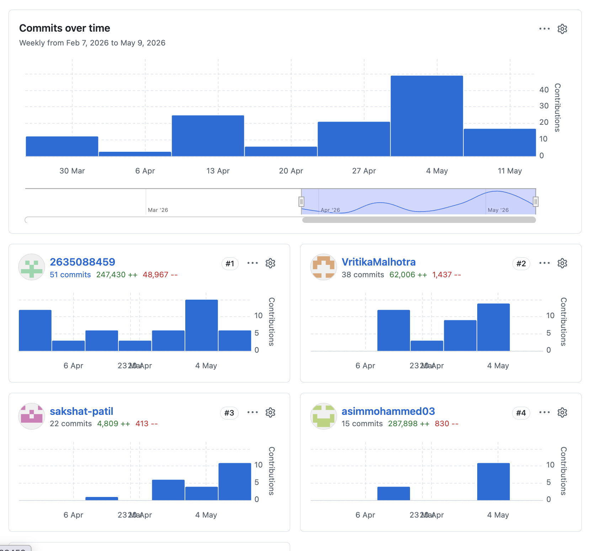

# EraseGraph Team GitHub Contributions
## GitHub Contributor Snapshot

Note: the screenshot shows the main GitHub accounts in the contributor dashboard. Some commits in local git history use different emails or aliases, so this write-up uses the screenshot as the main submission reference and the codebase itself to explain the actual work.

## Contribution Summary Table

| Member | GitHub Account | Snapshot Commits | Primary Contribution Areas |
|---|---|---:|---|
| Haoyuan Shan | `2635088459` | 51 | Backend foundation, Kubernetes/cloud deployment, observability, health aggregation, final integration and documentation |
| Vritika Malhotra | `VritikaMalhotra` | 38 | Reliability engineering, retry/DLQ, circuit breaker, idempotency, bulk deletion flow, frontend demo support |
| Sakshat Patil | `sakshat-patil` | 22 | Real-time frontend UX, proof timeline/export, history/admin pages, SSE-based live status experience |
| Asim Mohammed | `asimmohammed03` | 15 | Search and analytics cleanup services, notification flow, proof verification integration, consistency behavior and test support |

## Individual Contributions

### Haoyuan Shan

Haoyuan mainly worked on the backend foundation, deployment, and overall integration work. A lot of the work in this area was about making the whole system run together correctly, not just making one feature work in isolation.

- Built the main backend flow for deletion requests, including creating requests, checking request status, and returning proof data.
- Connected the backend with PostgreSQL and RabbitMQ so the deletion workflow could run across services.
- Added Kubernetes deployment files, Helm support, and cloud deployment related setup.
- Worked on observability features such as metrics, Prometheus/Grafana support, and service health aggregation.
- Also helped organize the final project structure and documentation so the project was easier to demo and submit.

### Vritika Malhotra

Vritika mainly worked on reliability features and some demo-related frontend/backend improvements. Her contribution was important for showing that our system can still behave correctly when failures happen.

- Implemented retry queue and dead-letter queue behavior for failed cleanup steps.
- Added idempotency handling so duplicate events would not cause the same deletion step to run twice.
- Worked on circuit breaker behavior and DLQ replay support for recovery.
- Added batch CSV deletion support and connected it with the bulk upload flow.
- Helped improve demo usability through dashboard, proof-related, and demo-user features.

### Sakshat Patil

Sakshat mainly worked on the frontend user experience, especially the parts that help users and instructors see what is happening in real time. His work made the system much easier to understand during demo.

- Built the real-time dashboard behavior using SSE-based status updates.
- Implemented the proof timeline, proof verification display, and export features.
- Added the History page and Admin page so users can check request history, service health, circuit status, and SLA violations.
- Helped connect backend streaming logic to the frontend so status changes show up clearly in the UI.

### Asim Mohammed

Asim mainly worked on extending the distributed workflow with more services and on the consistency side of the project. His contribution helped make the system feel more like a real multi-service deletion platform.

- Added important service-side work for search cleanup, analytics cleanup, and notification handling.
- Contributed backend updates related to proof verification and event flow integration.
- Helped define consistency-related behavior such as delayed completion, multi-step aggregation, and request state handling.
- Added or supported tests and documentation related to consistency and SSE/backend behavior.

